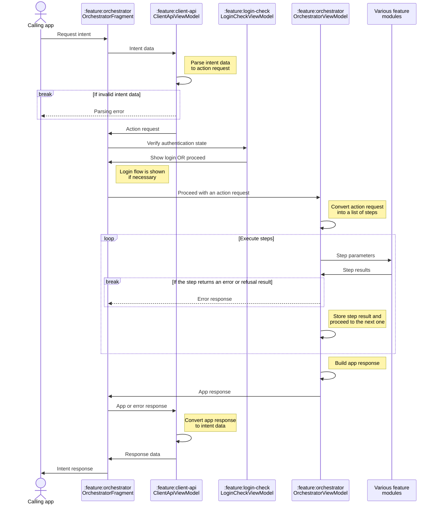
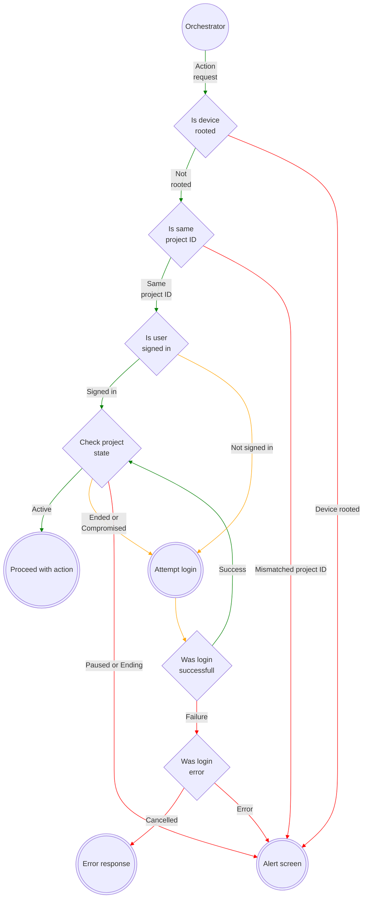

# Biometric flow orchestration

SID handles 3 main biometric flows

* Enrol - capture biometrics, assign a GUID and return it;
* Verify (aka 1:1) - capture biometrics, compare it to a locally stored record with the provided GUID, and return the confidence of the match;
* Identify (aka 1:N) - capture biometrics, compare it to locally stored records, and return the best matching result with confidence scores;

and 2 follow-up flows

* Enrol last biometric - after identification, if none of the returned results are valid, enrol the last captured biometric data with a new GUID and return it;
* Confirm identity - after identification, confirm that one of the returned results was correct to improve future identifications.

All flows follow the same execution flow within the application, with the main difference in the list of steps it goes through.

### Orchestration

The main entry point for action requests is `OrchestrationFragment` in the module `:feature:orchestrator` (while technically, there is also an `OrchestrationActivity`, its only function is to pass intent data into the navigation graph's root fragment arguments). This fragment is a glue between several feature modules that ensure full application flow.

#### Intent parsing and response compilation - `:feature:client-api`

* Takes care of parsing incoming requests and formatting outgoing data. While this module has no UI elements, it depends on the Android framework and exposes the view model as a module's public API.
* For the most straightforward integration within any caller application, it is highly recommended to use [LibSimprints](https://github.com/Simprints/LibSimprints). However, due to their relative popularity within the industry, SID also supports more direct integration with ODK and CommCare applications. Each of those 3 integrations has slight variations in the data format provided in incoming intent and expected response structure (for more specific details, check out `IntentToActionMapper.kt` and `ActionToIntentMapper.kt`).

#### Login state check - `:feature:login-check`

* Handles authentication state checks. While this module has no UI elements, it depends on the Android framework and exposes the view model as a module's public API.

#### Steps - `:feature:orchestrator`

* After all checks are done, the request is turned into a list of execution steps based on the type of action, enabled modalities and other parameters.
* Each step contains a unique identifier, navigation action ID, destination ID for response handling and payload bundle. After the step is executed, its result is added for future use. Once all steps are complete, the final application response is compiled based on the combined step results.&#x20;
* The step list with the results is cached on disk to allow follow-up actions. This cache is reset once the orchestrator determines the newly received request is not a follow-up.
* Step execution involves calling `.navigate()` on the navigation controller with the step's action ID and payload bundle. At the same time, the orchestration fragment is subscribed to handle results from any potential navigation target destination.&#x20;
* Since features might call each other and pass each other result, there are several things to keep in mind when handling the result:&#x20;
  * The only way to correctly get the currently executed step is to look for the first "IN\_PROGRESS" step in the list.
  * Result classes are consistent even when returned via different feature modules, so terminal/error results can only consider the class. For example, several feature modules can return the exit form result, but it will always be an instance of the same class.
* The matching step has some extra handling since it requires capturing step results as parameters. When building the step list, matching step arguments are stubbed. Once the capture result is available for the respective modality, the stub is replaced with correct arguments.

### Adding new step types to the orchestration

1. Create the new feature module with its own navigation graph and contract (see [project structure](project-structure.md#feature-modules)).
2. Add the new feature module to the orchestration module's `build.gradle` file.
3. Add step definition to appropriate flows in `BuildStepsUseCase.kt`.
4. Add step result handling in `OrchestratorFragment.onViewCreated()` using the destination defined in the new module's contract.
5. If the module has a potentially terminating result (e.g. error or refusal) add it to `MapRefusalOrErrorResultUseCase.kt`.
6. If step results affect the final flow response, make sure to add that in relevant places (e.g. `AppResponseBuilderUseCase.kt` or `UpdateDailyActivityUseCase.kt`.

