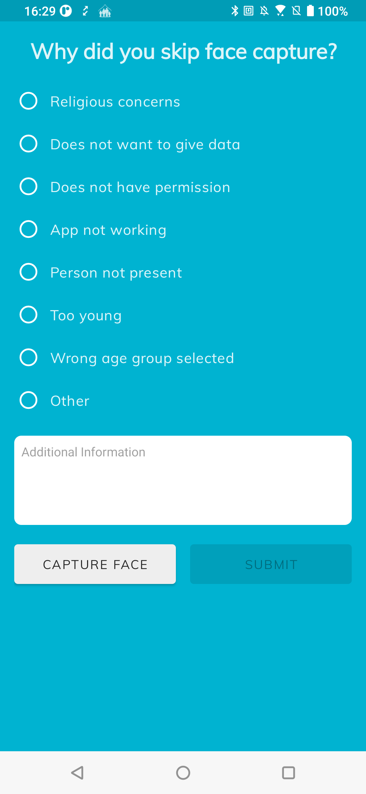

# Exit Forms

### What is an Exit Form?

An **exit form** is a form presented to the user to capture reasons for ending a biometric capture before completion. This form is triggered if the user presses the Android back button in the middle of the flow. This can be due to:

* the person to be captured not being present
* the person refusing consent for personal reasons
* technical reasons like Bluetooth or device malfunction

The form contains general reasons for the exit early, as well as a custom message box to indicate other reasons not specified. Whenever an exit occurs, the reason for the exit is available to the calling application and the values can be extracted for use within the calling application.

<figure><figcaption></figcaption></figure>

If you would like to get the **exit form** data that is sent back to inform your workflow when handling the result of a workflow, you can get the **RefusalForm** object with the properties:

* **reason** - indicates the reason for exiting the workflow
* **extra** - indicates any extra message

```kotlin

val simprintsLauncher = registerForActivityResult(SimprintsContract()) { response ->
    
    if (response.resultCode != Activity.RESULT_OK) {
        // check-out Handling Errors page for reference
    }
    
    if (response.refusalForm != null) {
        val reason = response.refusalForm.reason
        val extra = response.refusalForm.extra
    }

    // Handle response data
}
```


These are the reasons that **Simprints ID** can return:

* REFUSED\_RELIGION - returned when the biometric capture was refused due to religious concerns
* REFUSED\_DATA\_CONCERNS - returned when the biometric capture was refused due to personal data concerns
* REFUSED\_PERMISSION - returned when the beneficiary refuses permissions for biometric capture
* SCANNER\_NOT\_WORKING - returned when the fingerprint scanner is not working
* APP\_NOT\_WORKING - returned when SID app stops working during biometric capture
* REFUSED\_NOT\_PRESENT - returned when the beneficiary to be captured is not present themselves
* REFUSED\_YOUNG - returned when the beneficiary to be captured is too young
* WRONG\_AGE\_GROUP\_SELECTED - returned when a wrong choice was made on the age selection screen
* OTHER - returned when some other reason for refusal, has been provided.
