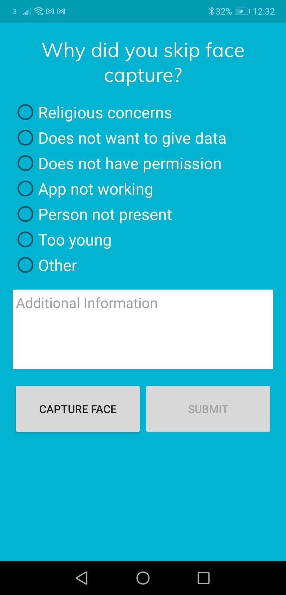

# Exit Forms

### What is an Exit Form?

An **exit form** is a form presented to the user to capture reasons for ending a biometric capture before completion. This form is triggered if the user presses the Android back button in the middle of the flow. This can be due to:

* the person to be captured not being present
* the person refusing consent for personal reasons
* technical reasons like bluetooth or device malfunction

The form contains general reasons for the exit early, as well as a custom message box to indicate other reasons not specified. Whenever an exit occurs, the reason for the exit is available to the calling application and the values can be extracted for use within the calling application.

<figure><figcaption></figcaption></figure>

If you would like to get the **exit form** data that is sent back to inform your workflow when handling the result of a workflow, you can get the **RefusalForm** object with properties:

* reason - indicates the reason for exiting the workflow, can be accessed using **getReason** method
* extra - indicates any extra message, it can be accessed using **getExtra** method

```
@Override

protected void onActivityResult(int requestCode, int resultCode, Intent data) {

if (resultCode != Activity.RESULT_OK) {

   //... code to handle error   

} else {

   //... code to check requestCode and resultCode

   // extract the boolean flag to indicating if the flow completed

   Boolean biometricsCompleted = 	data.getBooleanExtra(Constants.SIMPRINTS_BIOMETRICS_COMPLETE_CHECK);


   // check if the flow completed successfully

   if (biometricsCompleted) {

      //...code to handle success scenario

   } else {
   

      // check if this was actually due to an exit form

      if (data.hasExtra(Constants.SIMPRINTS_REFUSAL_FORM)) {


      // extract the RefusalForm value

      RefusalForm refusalForm = data.getParcelableExtra(Constants.SIMPRINTS_REFUSAL_FORM);

   
      // get access to the 'reason' and 'extra' values

        String reason = refusalForm.getReason();

        tring extra = refusalForm.getExtra();


      } else {

      //... code to handle alternate error scenario

      }

   }

}

}
```

These are the reasons that **Simprints ID** can return:

* REFUSED\_RELIGION - returned when the biometric capture was refused due to religious concerns
* REFUSED\_DATA\_CONCERNS - returned when the biometric capture was refused due to personal data concerns
* REFUSED\_PERMISSION - returned when the beneficiary refuses permissions for biometric capture
* SCANNER\_NOT\_WORKING - returned when the fingerprint scanner is not working
* APP\_NOT\_WORKING - returned when SID app stops working during biometric capture
* REFUSED\_NOT\_PRESENT - returned when the beneficiary to be captured is not present themselves
* REFUSED\_YOUNG - returned when the beneficiary to be captured is too young
* OTHER - returned when some other reason for refusal, has been provided.
