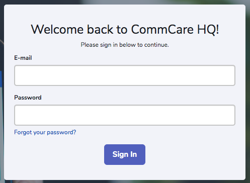
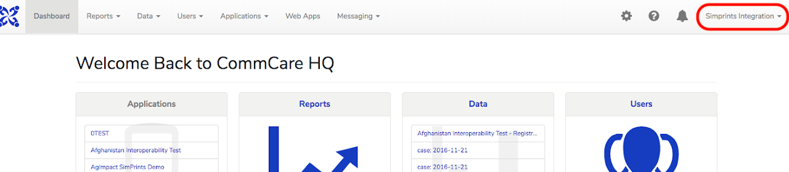
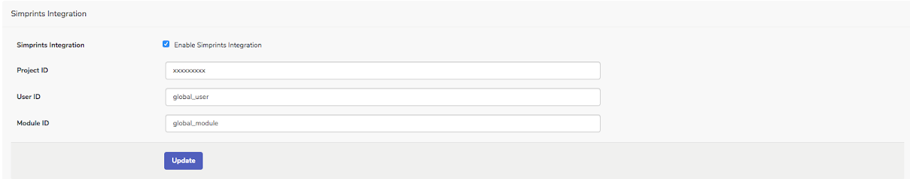
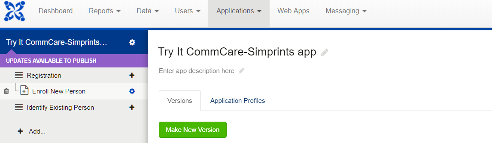

# CommCare Integration

#### CommCare has an existing integration for enrolling and identifying beneficiaries using Simprints. Follow the Quick Start guide to easily integrate Simprints to your CommCare application. 

### What is CommCare? 

### [CommCare](https://www.dimagi.com/commcare/) 

CommCare is a data collection platform that frontline workers can use to collect, track and manage a beneficiary's case over time. CommCare can work offline on Android phones and tablets. CommCare HQ is CommCare's server where a project manager will be able to design the data collection forms whilst the CommCare app will allow a frontline worker to download the forms and start managing a beneficiary's case,

Simprints integrates with CommCare to provide frontline workers with the ability to enrol and link a beneficiary's record to their biometrics. This will allow for a frontline worker to easily identify a beneficiary using their biometrics over time on follow-up appointments.

### Pre-requisites for integrating CommCare and Simprints 

### CommCare 

* CommCare account with an Advanced Software Plan\*
* Access to Simprints biometrics integration on CommCare HQ\*

\*Contact your CommCare sales representative if you do not have this enabled

### Simprints 

* Simprints Project ID\*
* Simprints QR code\*

\* Contact your Simprints Project Manager if you do not have this

### How to integrate CommCare and Simprints? 

You will need to integrate CommCare and Simprints using your CommCare HQ account. Please ensure that you have access to the Simprints integration module based on the pre-requisites above.

**Step 1:** Log-in to your CommCare HQ account

<figure><figcaption></figcaption></figure>

**Step 2:** Select the CommCare project you would like to integrate with Simprints

<figure><figcaption></figcaption></figure>

**Step 3:** Click the ⚙ icon, project settings and click Biometrics Integration. _If Biometrics Integration is not displayed as below, contact your CommCare representative to enable this._

<figure><figcaption></figcaption></figure>

**Step 4:** Complete the Simprints integration page:

* **✅** Simprints integration
* Complete the Project ID field with the Project ID provided by your Simprints Project Manager. _Contact your Simprints Project Manager if you do not have this_

**Step 5:** Click Update to save the Simprints integration

<figure><figcaption></figcaption></figure>

**Step 6:** To integrate Simprints in the correct application within your CommCare project. Simprints will now be integrated to:

* Your registration form to enrol a beneficiary with their biometrics
* Your case list for a frontline worker to identify a beneficiary using their biometrics

<figure><figcaption></figcaption></figure>

Select the CommCare application to integrate Simprints with

**Step 7:** Click + Add.. and click Biometrics to complete Simprints integration

<figure><figcaption></figcaption></figure>

**Step 8:** Congratulations, you have now successfully integrated Simprints as part of your CommCare application!

<figure><figcaption></figcaption></figure>

### Customising your CommCare and Simprints integration 

You can further customise your Simprints integration to add tags to a beneficiary's biometrics or to make Simprints a mandatory step in your frontline worker's workflow.

Click [here](commcare-enrolment.md) to find out more.

### &#x20; 
