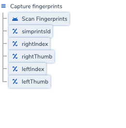
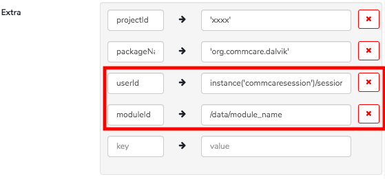
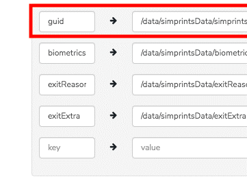
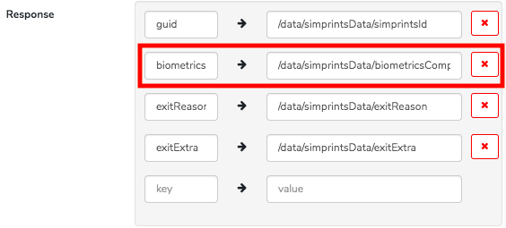
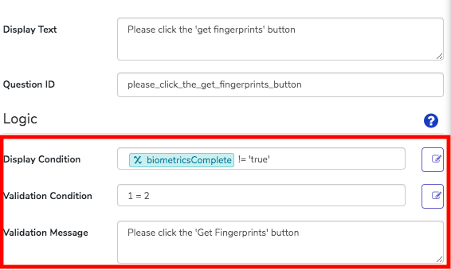
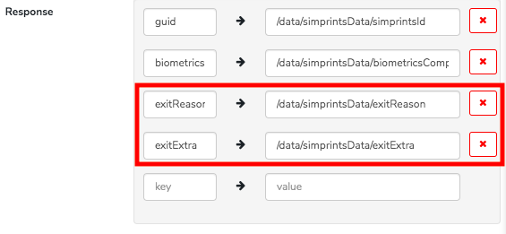

# CommCare: Enrolment

During enrolment, a beneficiary’s fingerprints will be registered and linked to their record on CommCare.

You can customise your Simprints enrolment integration to:

* Link a beneficiary's biometrics record to a particular user ID or module ID.&#x20;
* Check that a frontline worker has completed a Simprints session before moving forward in their workflow
* Collect and store data on why a beneficiary declined Simprints

To customise your Simprints integration, follow the steps below.

### Customise Simprints enrolment 

Before customising Simprints, you should have already completed the [Quick Start](./) integration. Follow the instructions below to customise your enrolment form.

**Step 1:** Click "Enroll new person"

You should see "Scan Fingerprints" in the list of questions.

<figure><figcaption></figcaption></figure>

**Step 2:** Create a question list group by: +Add Question > Groups > Question List

<figure><figcaption></figcaption></figure>

Name this question list the following:

* Display text: Capture fingerprints
* Question ID: simprintsData

<figure><figcaption></figcaption></figure>

**Step 3:** Add the "Scan Fingerprints" question and the hidden values (simprintsId, rightIndex, rightThumb, leftIndex, leftThumb) as sub-questions of the newly created "Capture Fingerprints" Question List. You do this by highlighting them and dragging underneath Capture Fingerprints. You can then delete rightIndex, rightThumb, leftIndex, leftThumb hidden values. They are not needed.

<figure><figcaption></figcaption></figure>

**Step 4:** Update the "External App" field within the "Scan Fingerprints" question:

* Click Custom in the dropdown list
* Update the value to: **com.simprints.commcare.REGISTER**

**Uncheck the Required button too!**

<figure><figcaption></figcaption></figure>

To customise the user ID and module ID linked to a beneficiary's biometrics record, follow the following steps. To find out more about what user ID and module ID is, click [here](../../)

**Step 5:** Update the "Extra" field within the "Scan Fingerprints" question as highlighted

* Link userId to the user logged into your CommCare application: **instance('commcaresession')/session/context/userid**
* Link moduleId to the module related question earlier in the form: **/data/REFQUESTION\***

\*REFQUESTION should be the question id related to the appropriate question

These steps will enable each beneficiary's biometrics record to be associated with a user ID and module ID.

<figure><figcaption></figcaption></figure>

**Step 6**: Update the "Response" field within the "Scan Fingerprints" question:

* the value for guid to: **/data/simprintsData/simprintsId**

<figure><figcaption></figcaption></figure>

In your CommCare form, you can check if a user has completed a Simprints session. A completed Simprints session could either be a successful enrolment or a beneficiary declining Simprints. Find out more about Biometrics Complete Check [here](../../integrating-with-simprints/tiers-and-confidence-scores.md).

If a frontline worker has not completed a Simprints session, you may add logic in your form to prevent them from continuing with their workflow.

To enable this check in your CommCare form, follow the steps below:

**Step 7:** Add the following keys and values under the "Response" field in the "Scan Fingerprints" question as highlighted:

* To check whether a user has completed a Simprints session, in your form add - Key: **biometricsComplete;** Value: **/data/simprintsData/biometricsComplete**

<figure><figcaption></figcaption></figure>

**Step 8:** Save the changes made to the "Scan Fingerprints" question

**Step 9:** Click +Add Question to add a Hidden Value question under the "Capture Fingerprints" question list:

* Fill out the Question ID field with **biometricsComplete**

**Step 10:** Save the changes made to the "biometricsComplete" Hidden Value question

<figure><figcaption></figcaption></figure>

**Step 11:** Click +Add Question to add a label under the "Capture Fingerprints" question list:

* Fill out the Display Text with **Please click the 'Get Fingerprints' button**

**Step 12:** Include the following logic (by clicking on the 3 horizontal lines in top right corner):

* Display Condition: **/data/simprintsData/biometricsComplete != 'true'**
* Validation Condition: **1=2**
* Validation Message: **Please click the 'Get Fingerprints' button**

**Step 13:** Save the changes made

<figure><figcaption></figcaption></figure>

In your CommCare form, you can record reasons why a user left the Simprints application form without collecting a beneficiary's biometrics. To enable this check in your CommCare form, follow the steps below:

**Step 14:** Click the "Scan Fingerprints" question

**Step 15:** Add the following keys and values under the Response field in the "Scan Fingerprints" question as highlighted:

* To collect reasons for a user exiting Simprints without collecting a beneficiary's biometrics, in your form add - Key: **exitReason;** Value: **/data/simprintsData/exitReason**
* To collect additional information for why a user left the Simprints app, in your form add Key: **exitExtra;** Value: **/data/simprintsData/exitExtra**

<figure><figcaption></figcaption></figure>

**Step 16:** Click +Add Question to add a Hidden Value question:

* Fill out the Question ID field with **exitReason**

**Step 17:** Save the changes made to the "exitReason" Hidden Value question

**Step 18:** Click +Add Question to add a Hidden Value question:

* Fill out the Question ID field with **exitExtra**

**Step 19:** Save the changes made to the "exitExtra" Hidden Value question

**Step 20:** Click the ⚙️ on the "Enroll New Person" form.

**Step 21:** Under "Save Questions to Case Properties", update the Case Property simprintsId to reference the correct question

* This should be the question referencing the hidden value for simprintsId

<figure><figcaption></figcaption></figure>

Congratulations! You have now customised your CommCare Simprints integration in your registration form.
