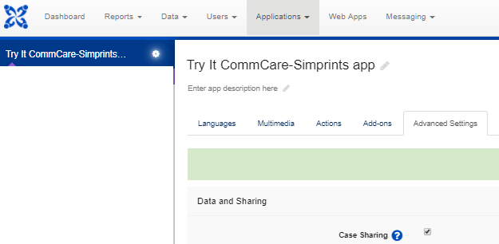

# FAQs

### How do I get the integrated app on my device? 

1. First, activate the “Case Sharing” option for the app, which you can find in the “Advanced Settings” tab, after clicking on the settings (gear) icon near the App name (see below)

<figure><figcaption></figcaption></figure>

2\. Make sure that you have a “Mobile Worker” user that is in a group that has the “Case Sharing” option active. Both the “Mobile Worker” user and the app must have the “Case Sharing” option active. Check the CommCare documentation if you are not sure how to do this.

3\. To deploy the app, click on the name of the app on the top -left corner, below the CommCare symbol - “Try It CommCare-Simprints…” in the example below.

<figure><figcaption></figcaption></figure>

4\. Click “Make New Version”. Click on “Released” to make the new created version available for download and finally click on “Publish” to get all the different options to download the app to your phone (Barcode, app code, offline, etc.).

<figure><figcaption></figcaption></figure>

5\. To install and launch your application on your Android Device

\*If you are adding a second application in CommCare (refer to screenshots below):

* Click the CommCare menu > Go To App Manager
* Click "Install an App" to continue

.png>).png>)

6\. Log-in to your application using the “Mobile Worker” user that you have configured.

7\. If the app is not working, check that the device’s settings are set as follows: click settings >> app permissions >> additional permissions >> enable read secure CommCare data

### During enrolment, there's a prompt on CommCare that an error has occurred and no fingerprints scanned. What does this mean? 

As of March 2018, Simprints has confirmed that a visual bug occurs once a beneficiary's fingerprints have been collected during enrolment. CommCare prompts an error saying that an error occurred and no fingerprints were scanned. This bug is only visual: the registration process is operating correctly in the background – you should be able to register people without problems. Please accept our apologies while we fix the bug
