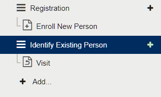

# Identification

During identification, a beneficiary’s fingerprints will be used to identify them against other records within the CommCare database.

### Run an identification 

Step 1: Select or create a new “Case List” (See enrolment for more information). This is going to be our biometric identification case list. The type of form for identification will need to be a follow-up form.

Step 2: Title the case list as you wish (for example, we have “Identify Existing Person” in the image below).

<figure><figcaption></figcaption></figure>

Step 3: Click the case list and configure the information that you want to display in the “Case List” and “Case Detail” tabs (Please refer to CommCare’s documentation for more information on this).&#x20;

At least check that the name (from enrolment) is in that list: the field Property = “name”, Display Text = Name (or other intuitive text you wish to insert), and Format = Plain.&#x20;

This is the text that will appear when you identify a previously-enrolled person using their fingerprints.

Step 4: In the Case List tab, scroll to the bottom and click Case List Search Callout section, tick the “Enable case list search callout” option.&#x20;

If the “Case List Search Callout” section is not visible, get in touch with CommCare support team for access to this. You will need this to integrate CommCare and Simprints for identification

Step 5: Complete the Case List Search Callout section as per below table and refer to screenshot:

<figure><figcaption></figcaption></figure>

<figure><figcaption></figcaption></figure>

\*For project ID, this will be provided by Simprints and for module ID, this can be configured based on your project

\*\* If there’s not enough extra rows, click the + add key → value pair

NB: When filling out the description of keys please ensure there are no spaces before or after values and add ‘’ marks (as per the table above and diagram below). If the description is nested within different form groups, the “/data/” path in the description should be substituted by the path you are working on. Refer to CommCare documentation for more information on this. Configuring this correctly is pertinent as the CommCare app may crash otherwise.

Step 6: Tick the “Display results in case list” option and click the “Save” button

This next portion is to implement what we would call a Confirmation. When a frontline worker has run identification, it is important to select and send confirmation that the correct person was found. This approach in the integration isn't perfect but it will allow for this confirmation to occur.

Step 7: Click on Followup with Person and Add Question > Multiple Choice

* Display Text: Did you use biometrics to identify a person?
* Question ID: did\_you\_use\_biometrics
* Click the checkbox for Required

Step 8: Click Add Question > Groups > Question List

* Display Text: Biometrics  // Question ID: biometrics

Step 9: Go to Add Question > Advanced > Android App Callout

* Display Text: Please press the get data button once and swipe to the next screen.
* Question ID: simprintscallout
* External App: Custom > com.simprints.commcare.CONFIRM\_IDENTITY
  * Extra: &#x20;
  * projectId > 'xxx' (depending on your project's project Id)
  * packageName > 'org.commcare.dalvik'&#x20;
  * selectedGuid > #case/simprintsId
  * Response:
  * biometricsComplete > /data/biometrics/biometricsComplete
  * Under Logic, in Display Condition: pull in the did\_you\_use\_biometrics key and add = 'yes'

Step 11: Go to Add Question > Add a Hidden Value, and just fill out the Question ID as biometrics Complete

Step 12: Go to Add Question > Add a Label

* Display Text: Please click the 'Get data' button
* Question ID: please\_click\_the\_get\_data\_button
* Under Logic, Display Condition: pull in the BiometricsComplete hidden value key and add != 'true'
* Validation Condition: 1 = 2
* Validation Message: Please click the 'Get data' button

Congratulations! You have now integrated CommCare with Simprints ID for identification.

\
