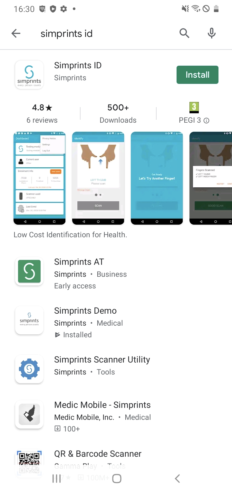

# Installation

## Downloading Simprints ID 

Two options for getting Simprints ID onto your phone are the Google Play Store or Sideloading via GitHub.

### **Download via Google Play Store**

1. Check your device is connected to the internet
2. Click the [link ](https://play.google.com/store/apps/details?id=com.simprints.id\&pcampaignid=web\_share)or&#x20;
3. Find this icon on your phone: 
4. Search Google Play, and you will find this icon.
5.  Open the app, and search ‘[Simprints ID](https://play.google.com/store/apps/details?id=com.simprints.id\&pcampaignid=web\_share)’

    
6. Install the app

### Sideloading via GitHub

Here's a step-by-step guide to help you through the process:

**1. Locate the APK File**

a. Visit our GitHub repository for [Simprint ID (SID)](https://github.com/Simprints/Android-Simprints-ID).

b. Navigate to the "[Releases](https://github.com/Simprints/Android-Simprints-ID/releases)" section.

**2. Download the APK File**

a. Click on the link associated with the APK file to initiate the download.

b. The APK file will be downloaded to your device's default download folder.

c. You can check the download progress in your device's file manager or notification area.

**3. Enable Unknown Sources Installation**

a. To install apps from sources other than the Google Play Store, you need to enable the "Unknown Sources" setting on your device.

b. Open the Settings app on your Android device.

c. Navigate to the "Security" or "Privacy" section.

d. Locate the "Unknown Sources" option and tap on it to enable it.

e. You may receive a warning message about the potential risks of installing apps from unknown sources.

f. Tap "OK" to confirm your decision.

**4. Install the Downloaded APK**

a. Locate the downloaded APK file in your device's file manager.

b. Tap on the APK file to initiate the installation process.

c. You may be prompted to grant additional permissions required by the app.

d. Review the permissions carefully and tap "Accept" or "Allow" if you agree to grant them.

e. The app will install and may launch automatically once the process is complete.

**5. Verify Installation**

a. Open the app drawer on your Android device.

b. Locate the installed app and tap on its icon to launch it.

c. The app should function normally, and you can explore its features.
