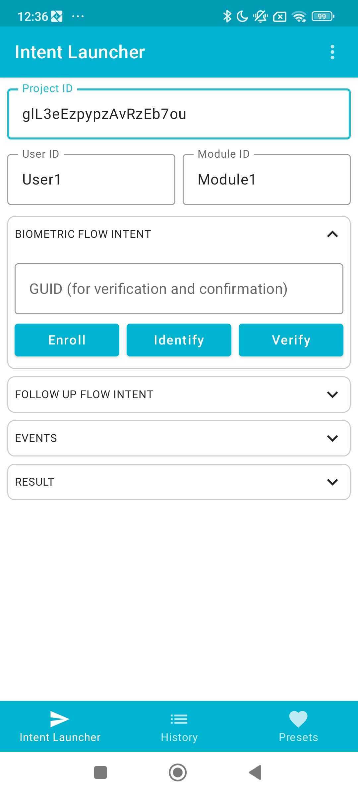
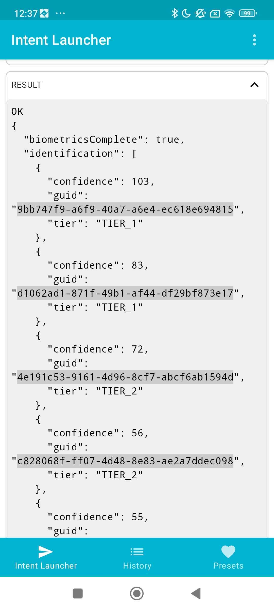

# Quick Start Guide


This guide was initially intended for Simprints staff who want to use and/or test Simprints for the first time. It assumes no prior knowledge and only covers the absolute essentials required for first-time setup.

As such, open-source users cannot perform steps 3 to 7 without support from Simprints. If you want to know more, please contact us via our Support[ channels](../../community-and-support/support-channels.md).


By the end of this guide, you should have:

* An understanding of Simprints core components
* Provisioned a biometric modality
* Captured some biometric data (either your Fingerprint or Face)

### Steps 

1. [Prerequisites](quick-start-guide.md#prerequisites)
2. &#x20;📱 [Download Android Apps](quick-start-guide.md#download-android-apps)
3. &#x20;🧬[ Provision of a biometric modality](quick-start-guide.md#provision-a-biometric-modality)
4. &#x20;📂 [Create a project](quick-start-guide.md#create-a-project)
5. &#x20;👉[ Perform an enrolment](quick-start-guide.md#perform-an-enrolment)
6. &#x20;✅[ Perform an identification](quick-start-guide.md#perform-an-identification)
7. &#x20;🔮 [What’s next?](quick-start-guide.md#whats-next)

## Prerequisites 

**Required**

* Android phone (most modern Android phones are supported; [check here](device-requirements.md) for full requirements)
* Web browser (hopefully, you are reading on one!)

**Optional**

* Vero scanner (needed for fingerprint)

## 📱 Download Android Apps 

Two apps are required to use Simprints:

**1. Simprints ID**

Simprints ID (SID) hosts the frontend biometric user flows (enrollment, identification, verification).

Download and install SID from the [Google Play store](https://play.google.com/store/apps/details?id=com.simprints.id\&hl=en\&gl=US)

**2. Intents Launcher**

SID is not a standalone application; it requires a **calling app** to open each flow.

* In a real project, the calling app would be a fully-fledged health record collection app (such as DHIS2 or CommCare)
* For this guide, we will use Simprints Intents Launcher (launching February 2024), a calling app developed by Simprints to test SID.

[Download link for Intents Launcher](https://github.com/Simprints/SID-Intent-Launcher/releases).

Install the APK on your phone

## 🧬 Provision of a biometric modality 

Simprints can be configured to support either Face and/or Fingerprint modalities. For simplicity, choose **one** of these for a first-time setup.

**Face**

Simprints has not developed its own Face algorithm (yet..). We use a commercial algorithm created by RankOne Computing, so each device using it must be provisioned with a license.

Unfortunately, we cannot release these to our open-source users. If you want to discuss this, we will help you. Get in touch with us via one of the methods listed [here](../../community-and-support/support-channels.md). We will need your device ID, too.

1. Open Simprints ID
2. Copy your device ID
3. &#x20;

**Fingerprint**

If you own a Vero scanner and want to use Fingerprint as your modality, you are in luck as Simprints has developed its Fingerprint algorithm, and although the algorithm isn't yet open source, you don’t need to do anything to provision it.

## 📂 Create a project 

Projects can currently be created in the closed-source Simprints back end. Projects contain:

* Configuration data
* Biometric licenses
* Biometric templates (face/fingerprint)

Projects are created and configured in **Vulcan (Not currently open source)**.

## 👉 Perform an enrolment 

You’re at the home stretch! Let’s perform an **Enrollment** to capture your biometric data to be checked against later.

1. Open Intents Launcher
2. Fill in `projectId` with the Project ID given to you by Simprints
3. You can use any `User Id` and `Module Id` (for instance "User1" and "Module1")
4. Leave all other fields as they are
5. Tap Enroll (this will open SID)
6. Login to SID by scanning the QR code generated in Vulcan
7. Follow the steps in SID to enroll
8. View the response in Intents Launcher.

<figure><figcaption>
Setup to Enroll
</figcaption></figure>

 

<figure><figcaption>
Result after enroll
</figcaption></figure>

Hopefully, you don’t experience any errors here. However, if you see something like “Invalid User ID” or “Invalid Project ID”, go back a step and check your Project configuration.

## ✅ Perform an identification 

Last part! Let’s perform an **Identification** to check if we can find the biometric record you created in the last step.

1. Open Intents Launcher
2. Fill in `Project Id` with the Project ID generated in Vulcan
3. You can use any `User Id` and `Module Id` (for instance "User1" and "Module1")
4. Tap Identify (this will open SID)
5. Follow the steps in SID
6. View the response; it should look something like this:

<figure><figcaption>
Setup to Identification is the same as for Enroll
</figcaption></figure>

 

<figure><figcaption>
Result of identification
</figcaption></figure>

## 🔮 What’s next? 

If you made it this far, congrats! You should understand how Simprints works and an end-to-end solution working on your phone to play around with.

Here are a few suggestions of what you could try and do next:

* Perform a verification
* Create your custom intent in Intents Launcher
