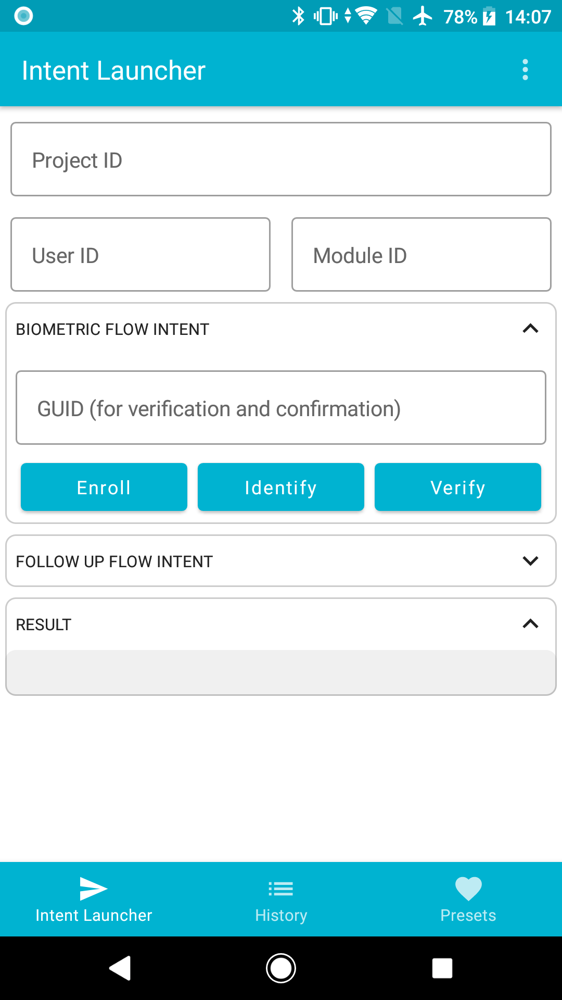

---
layout:
  title:
    visible: true
  description:
    visible: false
  tableOfContents:
    visible: true
  outline:
    visible: true
  pagination:
    visible: true
---

# SID Intents Launcher


Released Q1 2024


[SID Intents Launcher](https://github.com/Simprints/SID-Intent-Launcher) is an app that simulates a [calling app](data-collection-platforms/) for testing.&#x20;

The app's primary purpose is to ask SID to do something and look at the responses we get. It also serves as the reference implementation of [LibSimprints](https://github.com/Simprints/LibSimprints).&#x20;

Since it is a development tool, there are no plans to make an official Play Store version. Instead, it is intended to be side-loaded onto the device. The latest version of the tool is available on [GitHub](https://github.com/Simprints/SID-Intent-Launcher/releases).&#x20;

<figure><figcaption></figcaption></figure>

### Main features 

* Biometric flow integration
  * Enrol/Register
  * Identify
  * Verify
* Follow-up flows
  * Confirm Identification
  * Register last biometrics
* Results History&#x20;
* Intent configuration pre-sets
